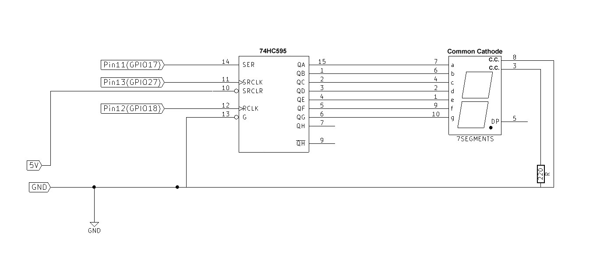

#Using 7-segment 

###Direct connection with 8 pins of Pi
[10_segment.py](10_segment.py)

###Using 74hc595 Serial input shift register
[10_segment_SN74HC595.py](10_segment_SN74HC595.py)

####Pins connection
| Digit | Qg | Qf | Qe | Qd | Qc | Qb | Qa |   Hex   |
|------:|:---|:---|----|----|----|----|----|---------|
| 0     |  0 |  1 |  1 |  1 |  1 |  1 |  1 |   0x3f  |
| 1     |  0 |  0 |  0 |  0 |  1 |  1 |  0 |   0x06  |
| 2     |  1 |  0 |  1 |  1 |  0 |  1 |  1 |   0x5b  |
| 3     |  1 |  0 |  0 |  1 |  1 |  1 |  1 |   0x4f  |
| 4     |  1 |  1 |  0 |  0 |  1 |  1 |  0 |   0x66  |
| 5     |  1 |  1 |  0 |  1 |  1 |  0 |  1 |   0x6d  |
| 6     |  1 |  1 |  1 |  1 |  1 |  0 |  1 |   0x7d  |
| 7     |  0 |  0 |  0 |  0 |  1 |  1 |  1 |   0x07  |
| 8     |  1 |  1 |  1 |  1 |  1 |  1 |  1 |   0x7f  |
| 9     |  1 |  1 |  0 |  1 |  1 |  1 |  1 |   0x6f  |
| A     |  1 |  1 |  1 |  0 |  1 |  1 |  1 |   0x77  |
| B     |  1 |  1 |  1 |  1 |  1 |  0 |  1 |   0x7d  |
| C     |  0 |  1 |  1 |  1 |  0 |  0 |  1 |   0x39  |
| D     |  1 |  0 |  1 |  1 |  1 |  1 |  0 |   0x5e  |
| E     |  1 |  1 |  1 |  1 |  0 |  0 |  1 |   0xf9  |
| F     |  1 |  1 |  1 |  0 |  0 |  0 |  1 |   0x71  |

